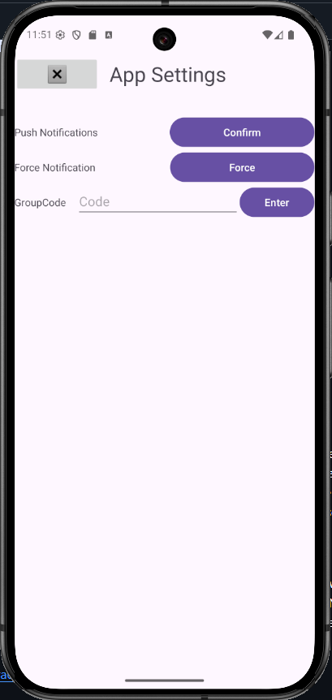

# Greg Pittman's ePortfolio
Event Tracker App 
Features: 
-User Login with  hashed passwords 
-Places API integration 
-Native date and time picker 
-Local Notifications 
-Group codes to share events across multiple users 
-Firebase Crashlytics  

 This artifact is a basic event tracker that I first completed for Mobile Architecture in August of 2025. It can handle multiple user accounts on a single device. It had basic event entry functionality. It was designed to have SMS notification features. The event entry activity screen took everything as text in boxes. The event list activity was set up to use cards, so if it was full, it would scroll. 

My two main updates in the first portion improve functionality and reduce the likelihood of bad user input. The date and time entry boxes in the new event activity screen now pop up with the default Android date and time selection pop-ups. The location selection now pops up with a search and auto-complete window. The Android date and time selection pop-ups were very straightforward. Getting the location auto-complete required a bit more work. I had to set up a project on Google Cloud to set the place API. I also started setting up push notifications following the Firebase setup tool. I got the Firebase console for the app set up. I expected push notifications to be far simpler. 

  

For the next milestone, the focus was on algorithms. The main focus was on sorting the events. I also finished the notifications. I did learn that the Android Studio built-in guide for notifications was for push notifications from a server and not notifications scheduled by the app client side. I converted the worker class from the last milestone to work for client-side notifications. I added the code to control how the notification would look in the main view class. In the settings menu, I converted the SMS request button into a notification request button. I also added a force notification button because of how I had it coded. 

The next major change was adding sorting to the events. Three buttons sort the events, and each button sorts differently. The Sort by Date button uses the output from the SQL query. Sort by Title uses a basic quicksort algorithm. Sort by location uses the List class's built-in sort function. While not very necessary for the current app, I also set up some basic password hashing. 

  

For this milestone the focus was on databases. I already have two databases in the project. A database for user and password information, and a database for events. For this I picked what I thought would be the simple task of adding group codes so multiple users could share the same event. I added an extra entry box on the event entry and a box in setting tab to add group codes. The problem I encountered was I was hoping I could use a list like datatype in the user database so I could store multiple group codes with each user. I found out the database would not accept that. The workaround I had to do was store them in a comma separated string. The get events now had to be modified to search for events in both tied to the user and the group code. 

I also cleaned things up. I removed my testing Toast popups. I removed older imports and variables I was not using anymore. Part of redoing the getEvents method, I also reworked todaysEvent and tomorrowsEvents to remove duplicate code. Now both of those call getEvent and search the events from that. For something this size the I really don’t need to query the database for each of those.  

<a href="Event Tracker Repo">https://github.com/Greggo-Waffles/EventTracker</a>   

Firebase distribution link: [Distro Link](https://appdistribution.firebase.dev/i/a6731f2ac31e61fc)   

<iframe width="560" height="315" src="https://www.youtube.com/embed/Z9sKwJ96vGs?si=R_SxonuH26VeAB39" title="YouTube video player" frameborder="0" allow="accelerometer; autoplay; clipboard-write; encrypted-media; gyroscope; picture-in-picture; web-share" referrerpolicy="strict-origin-when-cross-origin" allowfullscreen></iframe>

